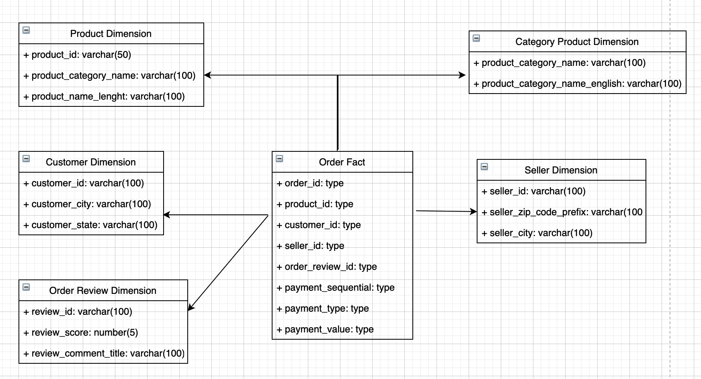
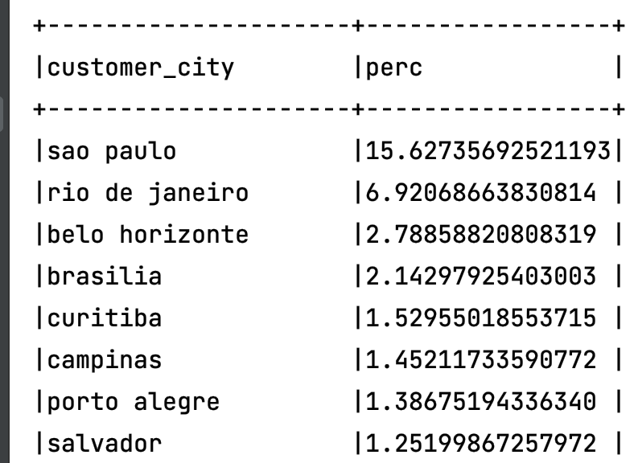
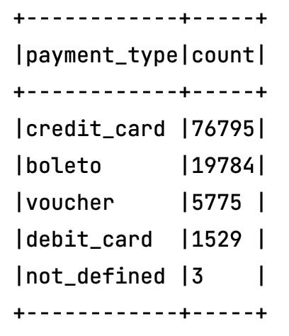

### ingestion_kaggle_top_cv
1. Các công nghệ sử dụng
- MongoDB: Lựa chọn để sử dụng lưu dữ liệu sau khi đã crawl về, bởi
    - Lượng dữ liệu lớn
    - Cần phản hồi nhanh
    - Cấu trúc dữ liệu có thể thay đổi
    - Hỗ trợ insert nhanh, dễ dàng mở rộng.
- Kafka: Lựa chọn để làm message queue của hệ thống, dữ liệu crawl về được đẩy vào kafka dùng cho mục đích inges data và analytic realtime. Lựa chọn kafka bởi:
    - Là hệ thống message pub/sub phân tán
    - Có khả năng truyền một lượng lớn message theo thời gian thực
    - Giúp chia các loại dữ liệu vào từng topic khác nhau
    - Hệ thống ecommerce có nhiều tác vụ khác nhau, đều truy vấn đến CSDL nên sẽ tạo ra nhiều pipeline nên nếu có Kafka ở giữa điều phối thì sẽ tách rời các data pipeline
      giữa các hệ thống để làm cho việc giao tiếp giữa các hệ thống trở nên đơn giản và dễ quản lý
- Spark streaming: Sử dụng để đọc dữ liệu từ kafka, đảm bảo dữ liệu cho model ingestion được cập nhật liên tục.
    - Chia dữ liệu đầu vào thành các mini batches để xử lý -> khả năng xử lý lô theo thời gian thực
    - Tương thích với kafka, mongo
    - Xử lý phân tán trên nhiều servers
2. Thiết kế schema của database
- Sử dụng data modeling star-schema, bao gồm:
    - 1 bảng fact: Order fact
    - Các bảng dimension: category product, product, customer, seller, order review,
    
    - Mô hình star-schema sẽ xoáy quanh các đơn hàng (order), các liên kết sẽ chỉ rõ context của dữ liệu
      và nối trực tiếp tới bảng Fact mà không cần thông qua nhiều bảng trung gian như mô hình 3NF.
      Phù hợp cho mục đích khai thác, phân tích dữ liệu.
3. Cách cài đặt và chạy project
- Cài đặt Kafka, Mongo, (thay thế cho hive để lưu star-schema) bằng docker
- Thêm các thư viện cần thiết trong file pom.xml
- Build project: 
  > mvn clean install 
- Chạy class để crawl data và đẩy dữ liệu vào kafka, mongo
  > java -cp target/ingestion_kaggle_top_cv-1.0-SNAPSHOT.jar kaggle.commerce.Main
- Chạy class spark-streaming để lắng nghe và ingess data vào Mongo
  > java -cp target/ingestion_kaggle_top_cv-1.0-SNAPSHOT.jar kaggle.commerce.crawler.IngestionData
- Liệt kê 1 số insight như:
  > java -cp target/ingestion_kaggle_top_cv-1.0-SNAPSHOT.jar kaggle.commerce.InsightDetection
  - Tỷ lệ khách hàng tại mỗi thành phố
    
  - Số lượng các kiểu thanh toán
    

